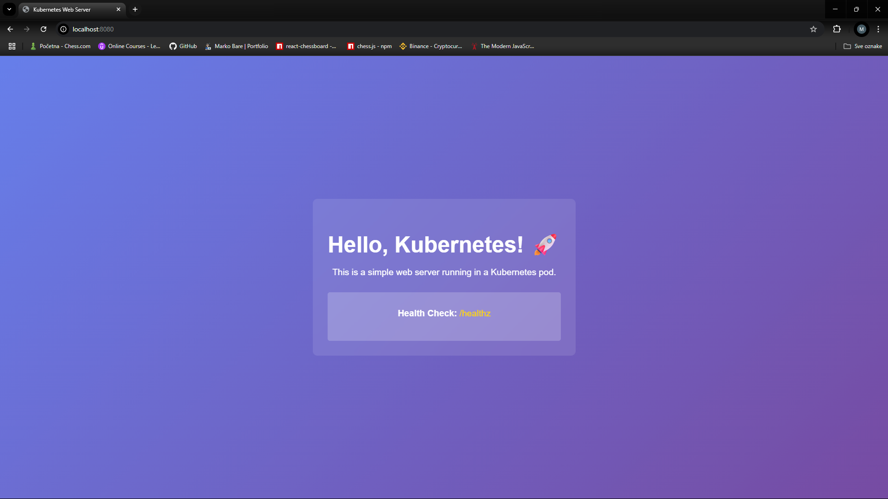
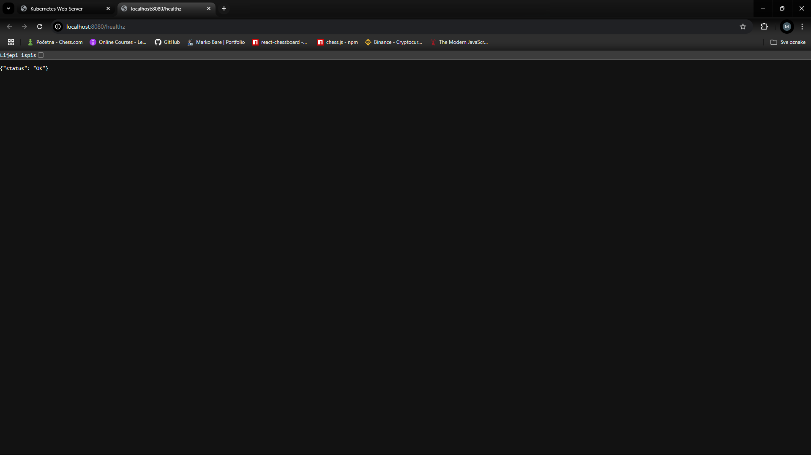
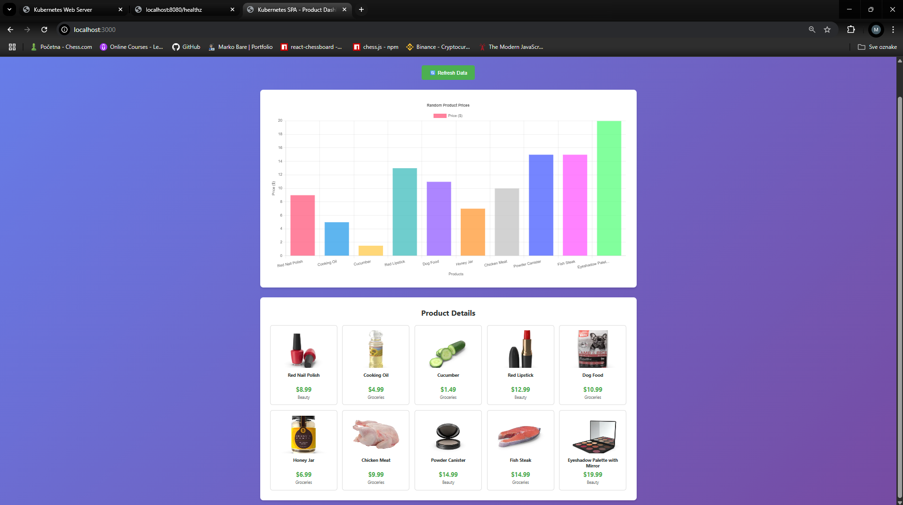
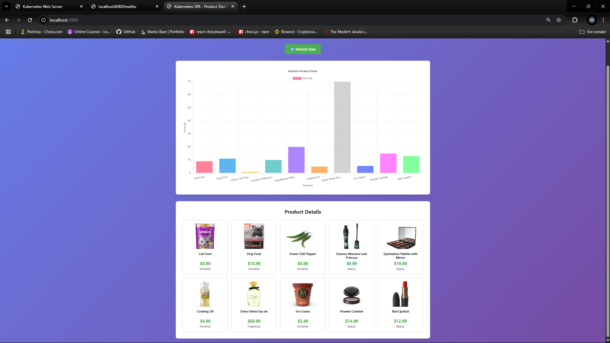
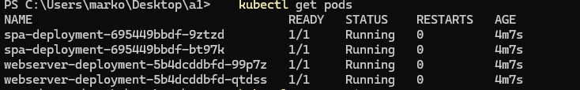
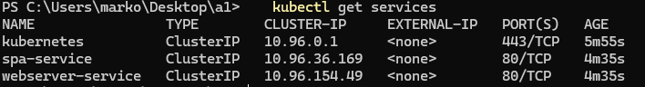

# Kubernetes Web Server & SPA Project

This project demonstrates a complete Kubernetes deployment with two services:
1. **Web Server**: A simple Nginx-based server serving static content and health checks
2. **SPA**: A React Vite single-page application that displays product data with charts

## Prerequisites

- Docker
- kind (Kubernetes in Docker)
- kubectl
- Node.js (for local development)

### Platform Support
- **Linux/macOS**: Use the provided `.sh` scripts
- **Windows**: Use the provided `.ps1` PowerShell scripts
- **Cross-platform**: All Docker and Kubernetes commands work on all platforms

## Quick Start

### Automated Setup (Recommended)

**Linux/macOS:**
```bash
./setup.sh
```

**Windows PowerShell:**
```powershell
.\setup.ps1
```

### Manual Setup

```bash
# Create kind cluster
kind create cluster --name my-cluster

# Build and deploy web server
docker build -t webserver:latest ./webserver
kind load docker-image webserver:latest --name my-cluster

# Build and deploy SPA
docker build -t spa:latest ./spa
kind load docker-image spa:latest --name my-cluster

# Deploy to Kubernetes
kubectl apply -f ./k8s/

# Port forward services (run in separate terminals)
kubectl port-forward svc/webserver-service 8080:80
kubectl port-forward svc/spa-service 3000:80
```

## Part 1 - Web Server

### Build & Deploy Steps

1. **Build Docker Image**:
   ```bash
   docker build -t webserver:latest ./webserver
   ```

2. **Load Image to kind**:
   ```bash
   kind load docker-image webserver:latest --name my-cluster
   ```

3. **Deploy to Kubernetes**:
   ```bash
   kubectl apply -f ./k8s/webserver-deployment.yaml
   kubectl apply -f ./k8s/webserver-service.yaml
   ```

4. **Health Check**:
   ```bash
   kubectl port-forward svc/webserver-service 8080:80
   curl http://localhost:8080/healthz
   ```

### Features
- Serves static HTML at root (`/`)
- Health check endpoint at `/healthz` returning JSON
- Nginx-based for reliability and performance

## Part 2 - SPA (Single Page Application)

### Build & Deploy Steps

1. **Local Development**:
   ```bash
   cd spa
   npm install
   npm run dev
   ```

2. **Build for Production**:
   ```bash
   cd spa
   npm run build
   ```

3. **Build Docker Image**:
   ```bash
   docker build -t spa:latest ./spa
   ```

4. **Load Image to kind**:
   ```bash
   kind load docker-image spa:latest --name my-cluster
   ```

5. **Deploy to Kubernetes**:
   ```bash
   kubectl apply -f ./k8s/spa-deployment.yaml
   kubectl apply -f ./k8s/spa-service.yaml
   ```

### Features
- React Vite-based SPA
- Fetches data from DummyJSON API
- Displays bar chart of 10 random products
- Refresh button to get new random data
- Chart.js for data visualization

## How to Run & Access Services

### 1. Create Kind Cluster
```bash
kind create cluster --name my-cluster
```

### 2. Build and Load Images
```bash
# Web Server
docker build -t webserver:latest ./webserver
kind load docker-image webserver:latest --name my-cluster

# SPA
docker build -t spa:latest ./spa
kind load docker-image spa:latest --name my-cluster
```

### 3. Deploy to Kubernetes
```bash
kubectl apply -f ./k8s/
```

### 4. Access Services
```bash
# Web Server (Port 8080)
kubectl port-forward svc/webserver-service 8080:80
# Visit: http://localhost:8080

# SPA (Port 3000)
kubectl port-forward svc/spa-service 3000:80
# Visit: http://localhost:3000
```

### 5. Verify Deployments
```bash
kubectl get pods
kubectl get services
kubectl logs -l app=webserver
kubectl logs -l app=spa
```

### 6. Test Services

**Linux/macOS:**
```bash
./test-services.sh
```

**Windows PowerShell:**
```powershell
.\test-services.ps1
```

**Manual Testing:**
```bash
# Test webserver health check
curl http://localhost:8080/healthz

# Windows PowerShell alternative
Invoke-RestMethod http://localhost:8080/healthz
```

## Useful Commands

```bash
# Restart deployments
kubectl rollout restart deployment webserver-deployment
kubectl rollout restart deployment spa-deployment

# Scale deployments
kubectl scale deployment webserver-deployment --replicas=3
kubectl scale deployment spa-deployment --replicas=2

# Clean up
kubectl delete -f ./k8s/
kind delete cluster --name my-cluster
```

## Screenshots

### Web Server

*The web server displaying "Hello, Kubernetes!" message*


*JSON response from /healthz endpoint showing {"status": "OK"}*

### Single Page Application

*SPA showing bar chart of 10 random products from DummyJSON*


*SPA showing new random set of products after clicking refresh button*

### Kubernetes Dashboard

*kubectl get pods showing both webserver and spa deployments running*


*kubectl get services showing webserver-service and spa-service*

## Project Structure

```
.
├── README.md
├── setup.sh                   # Linux/macOS setup script
├── setup.ps1                  # Windows PowerShell setup script
├── test-services.sh           # Linux/macOS testing script  
├── test-services.ps1          # Windows PowerShell testing script
├── webserver/
│   ├── Dockerfile
│   ├── nginx.conf
│   ├── index.html
│   └── healthz.json
├── spa/
│   ├── Dockerfile
│   ├── package.json
│   ├── vite.config.js
│   ├── index.html
│   └── src/
│       ├── main.jsx
│       ├── App.jsx
│       ├── components/
│       │   ├── Header/
│       │   ├── ProductChart/
│       │   ├── ProductGrid/
│       │   ├── RefreshButton/
│       │   ├── LoadingSpinner/
│       │   └── ErrorMessage/
│       ├── hooks/
│       │   └── useProducts.js
│       ├── utils/
│       │   ├── productService.js
│       │   └── chartConfig.js
│       └── styles/
│           └── global.css
└── k8s/
    ├── webserver-deployment.yaml
    ├── webserver-service.yaml
    ├── spa-deployment.yaml
    └── spa-service.yaml
``` 